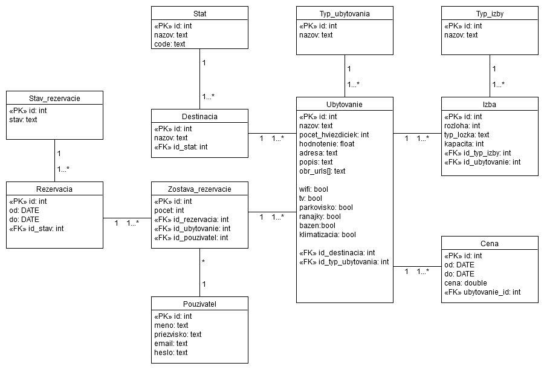

# Zadanie
Vo vami zvolenom prostredí vytvorte databázovú aplikáciu, ktorá komplexne rieši pä vami zadefinovanıch scenárov (prípadov pouitia) vo vami zvolenej doméne tak, aby ste demonštrovali vyuitie relaènej databázy pod¾a pokynov uvedenıch nišie. Presnı rozsah a konkretizáciu scenárov si dohodnete s Vašim cvièiacim na cvièení. Projekt sa rieši vo dvojiciach, prièom sa oèakáva, e na synchronizáciu práce so spoluiakom / spoluiaèkou pouijete git. 
# Aplikácia - Bookme
Je aplikácia na preh¾adné, jednoduché a pohodlné rezervovanie a zakúpenie ubytovania pre ¾udí èo cestujú, èi u za prácou, dobrodrústvom alebo
dovolenkou a relaxom. Pouívate¾ si môe prezera ponuky ubytovania v hoteloch, penziónoch a apartmánoch z celého sveta na jednom mieste.
Ponuky si vie odfiltrova pod¾a svojich potrieb a preferencii. Samozrejmosou je vıber typu ubytovania, cenovej hranice, poètu nocí, polohy ubytovania
a vzdialenosti od centra, ale vie si vybra aj pod¾a poètu hviezdièiek, ponúkanıch sluieb (reštaurácia, jedlo v cene ubytovania, wellness, telocvièòa,
free Wi-Fi, recepcia 24/7) ale aj pod¾a odporúèaní zákazníkov, ktorı tam u ubytovanı boli. Keï si pouívate¾ vyberie ubytovanie ktoré mu vyhovuje,
tak si ho môe cez aplikáciu, po zadaní platobnej karty a svojich údajov ktoré si vie aj uloi do budúcna, po registrácií alebo prihlásení rezervova alebo rovno zakúpi.
V oboch prípadoch bude informovanı poskytovate¾ ubytovania a pouívate¾ovi sa v aplikácii pridá do zoznamu jeho ubytovaní, kde si môe sledova aktuálny
stav svojich rezervácii alebo platieb. V tomto zozname ubytovaní nájde pouívate¾, keï si otvorí poadovanú poloku, všetko èo potrebuje. Môe v òom zruši  
rezerváciu (pokia¾ nezmeškal monı termín na zrušenie rezervácie), komunikova s poskytovate¾om ubytovania alebo sa preukáza rezervaènım èíslom pre
jednoduché a rıchle ubytovanie.
## Dátovı model 

### Opis modelu:
#### Ubytovanie
Za ubytovanie povaujeme miesto, na ktorom je moné prespa a v reálnom svete ho mono povaova èi u za samostatnú izbu v súkromí, alebo "izbu" (s kúpe¾òou alebo viacerími miestnosami) v hoteli, èi apartmán.
Pozostáva z názvu ubytovania, poètu hviezdièiek daného ubytovania, hodnotenia, adresy, popisu, po¾a url vykreslovanıch obrázkov, poètu izieb a moností pre filtrovanie.
Kadé ubytovanie sa nachádza v destnácií, prislúcha mu typ ubytovania - èi sa jedná o hotel, apartmán, izbu v súkromí, chatu atï.
Kadé ubytovanie musí ma aspoò jednu izbu, v tomto prípade sa jedná o miestnos v ktorej sa nachádza lôko.
Kadému ubytovaniu prislúcha v èase práve jedna cena.
#### Zostava rezervácie
Jedná sa o väzobnú entitu. Cez túto entitu priraïujeme k práve jednej rezervácií 1...n ubytovaní pre práve jedného pouívate¾a.

## Scenáre

### Scenár 1 - hlavná obrazovka

#### Opis scenára 1
Po spustení aplikácie sa otvorí hlavné okno s ponukami ubytovaní ktoré sa nachádzajú v databáze.\
Informácie ktoré sa získavajú z databázy:
* Názov ubytovania
* Poèet hviezdièiek ktoré má danı hotel
* Obrázok ubytovania (cez URL)
* Názov destinácie, adresa 
* Popis
* Hodnotenie, Cena

#### Podscenár 1.1 - Stránkovanie
Tlaèidlami < a > v spodnej èasti hlavného okna je moné posúva sa po stránkach - predvolene 10 ponúk.
#### Podscenár 1.2 - Základné vyh¾adávanie
Pri základnom vyh¾adávaní sa oèakáva zadanie destinácie, dátumov zaèiatku a konca rezervácie, poètu osôb a poètu izieb.
Po stlaèení tlaèidla h¾ada systém naplní ponuku s vyhovujúcimi ubytovaniami.
#### Podscenár 1.3 - Filter
Po stlaèení tlaèidla filtruj sa filter aplikuje na práve vypísané ponuky, teda pri základnom scenári na predvolenú ponuku, po podscenári 1.2 na vyh¾adané ponuky.

### Scenár 2 - detail ubytovania

#### Opis scenára 2
Náh¾ad na detail ubytovania v ktorom sa vypíše viacero detailov ktoré neboli vidite¾né v scenári 1.
Stlaèením tlaèidla spä sa dostane nazad medzi prezerané hotely v predchádzajúcom kroku.

### Scenár 3 - rezervácia

#### Opis scenára è.3
Po kliknutí na tlaèidlo rezervova sa zobrazí (zatia¾) dialógové okno s informáciou "Rezervácia Od DD.MM.YYYY do DD.MM.YYYY bola vytvorena".\
Táto rezervácia sa pridá do príslušnıch tabuliek - Rezervacia, Zostava rezervácie.\
Pre vytvorenie rezervácie musí by pouívate¾ prihlásenı, inak mu systém nedovolí vytvori rezerváciu.\

#### Podscenár 3.1 Registrácia
Pre rezerváciu je potrebné by zaregistrovanı a prihlásenı. Po kliknutí na tlaèidlo Registruj sa, sa otvorí okno pre vyplnenie údajov potrebnıch pre registráciu.
Systém vytiahne z db meno pouívate¾a a v hlavnom okne je "Vitaj meno_pouívate¾a".

#### Podscenár 3.2 Prihlásenie
Po správnom vyplnení emailu a hesla pre prihlásenie a stlaèení tlaèidla prihlási sa, systém vytiahne z db meno pouívate¾a a v hlavnom okne je "Vitaj meno_pouívate¾a".
Ak nie je správny email (nebol zaregistrovanı èi je zle vyplnenı) alebo heslo je nesprávne, ale email správny, tak systém vypíše chybovú hlášku.
Tieto údaje sa nachádzajú v tabu¾ke Pouívate¾.

### Scenár 4 - Preh¾ad rezervácií

Po kliknutí na tlaèidlo Moje Rezervacie sa otvorí preh¾ad s informáciami o rezerváciach pre práve prihláseného pouívate¾a.\
Inormácie zobrazované v preh¾ade rezervácií:
* Èíslo rezervácie
* Poèet izieb za danú rezerváciu
* Dátum od kedy je rezervácia platná
* Dátum do kedy je rezervácia platná
* Názov ubytovania
* Adresa ubytovania
* Stav rezervácie
Tlaèidlo s monosou úpravy alebo zmazania rezervácie.

Tlaèidlom spä sa pouívate¾ vráti na preh¾ad ubytovaní

#### Podscenár 4.1 Zmena rezervácie

Otvorí sa okno s detailami rezervácie, monosou zmeny dátumu a "úhrady" rezervácie.
Zmena záznamu sa vykonáva cez transakcie.

#### Podscenár 4.2 Zrušenie rezervácie
V preh¾ade rezervácií po kliknutí na tlaèidlo Zrusit sa rezervácia zruší - zmae sa z tabu¾ky a
aj v preh¾ade.

## Opis návrhu a implementácie
### Programové prostredie
Aplikácia je desktopová urèená pre OS Windows, implementovaná v programovacom jazyku C#, v prostredí Visual Studio. Vyuíva postgres DB.
### Návrhové rozhodnutia
K DB sa pristupuje pomocou Npgsql, pripojenie k DB prebieha cez NpgsqlConnection vdy keï je poiadavka na vıber z DB. Do NpgsqlConnection vstupuje adresa servera, port, userID, heslo a názov DB.
Na poiadavky na vıber z DB je implementovaná vlastná trieda PostGreSQL, kde do jej konštruktora vstupujú údaje na pripojenie do DB. Táto trieda ma vlastnú metódu Query do ktorej vstupuje string pre poiadavku, vracia List<string> kde string má formát "stlpec1,stlpec2,stlpec3...stlpecN". 

### Opis implementácie 
Z grafického h¾adiska pouité prvky poskytovná cez Toolbox.

#### Scenár 1 - hlavná obrazovka
Hlavné okno - vyuíva User Control HotelPolozka. Jednotlivé poloky sú dynamicky generované pri spustení aplikácie v metóde napln_ponuku. Poèet záznamov na stránku je 10.

#### Podscenár 1.2 - Základné vyh¾adávanie
V Bookme.cs btnHladat_Click - Vıber z tabuliek destinacia, stat - kde sa adresa, nazov statu alebo nazov destinacie zhoduje so zadanım textom a naplnenie ponuky pod¾a odpovede z DB.

#### Podscenár 1.3 - Filter
V Bookme.cs btnFiltruj_Click - vıber z tabu¾ky ubytovaní pod¾a checkboxov.

#### Scenár 2 - detail ubytovania
UserControl HotelDetail(HotelPolozka hotelPolozka). Dáta sú èerpané z poloky hotela, ubytovania.\
V Bookme.cs tlaèidlo rezervuj - pripojenie do DB, insert do tabu¾ky rezervácií a zostavy rezervácií.
Metoda NaplnPolozky() - naplnenie obrazovky detailu hotela,
Metoda VykresliObr() - vykreslenie náhladu fotiek hotela, max to¾ko, ko¾ko je v ubytovanie obr_urls[]
Metoda Obrazky_Click() - zobrazenie vybraného obrázku z náh¾adu

#### Scenár 3 - rezervácia
V triede HotelDetail btnRezervuj_Click\
Insert do tabuliek rezervacia a zostava rezervacie

#### Podscenár 3.1 - Registrácia
V Bookme.cs btnRegistracia_Click - V novom threade sa vytvorí okno s UserControl Registracia.cs kde pouívate¾ vyplní údaje.
Ak sú všetky údaje vyplnené, tak v Registracia.btnRegistruj_Click sa spravi insert do tabu¾ky pouívate¾ov.
Ak nie, vypíše sa chybová hláška. Email na platnos nekontrolujem, heslo je uloené ako plain text, nehashujem ho.

#### Podscenár 3.2 Prihlásenie
V Bookme.cs btnPrihlas_Click - overenie hesla k prislúchajúcemu emailu v tabu¾ke pouívate¾ov.
Po prihlásení zmena pre prihlásenie na UserControl PrihlasenyHlavicka.

#### Scenár 4 - Preh¾ad rezervácií
UserControl MojeRezervacie - naplnenie pod¾a selektu z DB.

### Generovanie dát
Dáta do tabuliek sa generujú cez skript v adresári data./ 
Dáta je treba generova postupne, pod¾a prepojenia tabuliek.
SQL skripty na vytvorenie èíselníkov typ_ubytovania, typ_izby, stav_rezervacie, sú v adresári data./
Skript pre vytvorenie tabuliek v schema/ create_tables.sql
#### Sahovanie URL pre obrázky
Spustenie s: -u conn_info.txt V conn_info su informácie pre pripojenie k DB.
Sahovanie prebieha tak, e sa odošle web request, ak nieje error, url sa uloí do súboru. Následne èakám 3ms (aby ma náhodou nevypli). 
Defaultne sa ahá z url s prefixom https://r-ak.bstatic.com/images/hotel/max500/150/150 za ktorım nasleduje 6-èíslie od 0 po 999999.
URL sa ukladajú do urls.txt, ktorı sa spracováva pri generovaní ubytovaní.
#### Vkladanie Štátov
Spustenie s: -s staty.json conn_info.txt
Do tabu¾ky štátov povkladná názvy a kódy štátov v subore staty.json.
#### Vkladanie Destinácií
Spustenie s: -d destinations.json 
Do tabu¾ky destnácií povkladá destinácie na základe kódu štátu v súbore destinations.json a pridá FK.

#### Generovanie ubytovaní
Spustenie s: -a adresses.json N, kde N je poèet generovanıch záznamov.\
Vyuíva names.csv, urls.txt\
Skladanie názvu: random z typu ubytovania + meno z meno.csv\
Ukldanie adries obrázkov z urls.txt\
Ukladanie adreis ubytovaní z adresses.json, popis ubytovanie: natvrdo danı jeden odstavec lorem ipsum\
random: ostatné paramentre

#### Generovanie izieb
Spustenie s: -r conn_info.txt\
Pod¾a druhu ubytovania sa vygeneruje poèet izieb pre dané ubytovanie, náhodne sa vyberie typ lôka a pod¾a toho sa urèí kapacita, ve¾kos izby - random.
## TODO
- [X] Scenár 3 - Detail a potvrdenie rezervácie
- [X] Scenár 2 - Izby pre dané ubytovanie
- [X] Scenár 2 - Detail hotela - ïalšie informácie
- [X] Model - Tabu¾ka so monımi stavmi rezervácií
- [X] Scenár 4 - Jednotlivé vytvorené rezervácie v samostatnom UserControl
- [X] Scenár 5 - zmena, zmazanie rezervácie 
- [X] pouitie transakcií + FK
- [ ] Naplni DB zmysluplnımi cenami
- [X] Stránkovanie
- [X] Optimalizacia pouzitej pamati pri vytvarani a ruseni stranok
- [ ] Usporiadanie pod¾a kritérií
- [X] Všetky Queries cez cmd.Parameters
- [X] Kompletnı podscenár 1.2 (datum, izby, osoby)
- [X] Dorobenie lepšieho vyskladnávanie Query
- [ ] Automatické prihlásenie po registrácií
- [ ] V dokumentácií predpisy tvaru súborov pre generovanie
- [X] dogenerovanie dát
- [X] GROUP BY
## Min. poziadavky
- [X] Min. 7 tabuliek okrem èíselínkov
- [ ] Rádovo milóny v kadej tab. okrem èíselníkov
- [ ] V jednej 10 mil
- [X] Join-y
- [X] Pouitie agregaènej funkcie
- [X] Zobrazenie preh¾adu všetkıch záznamov so stránkovaním + GRUOP BY
- [X] Filtrovanie pod¾a zadanıch kriterií
- [X] Detail záznamu
- [X] Vytvorenie záznamu (Novı pouívate¾, rezervácia)
- [X] Aktualizácia existujúceho záznamu
- [X] Vymazanie záznamu
- [X] Scenáre ktoré menia dáta musia by realizované s pouitím transkacií + aspoò jeden s viacerımi tabu¾kami (FK) e
